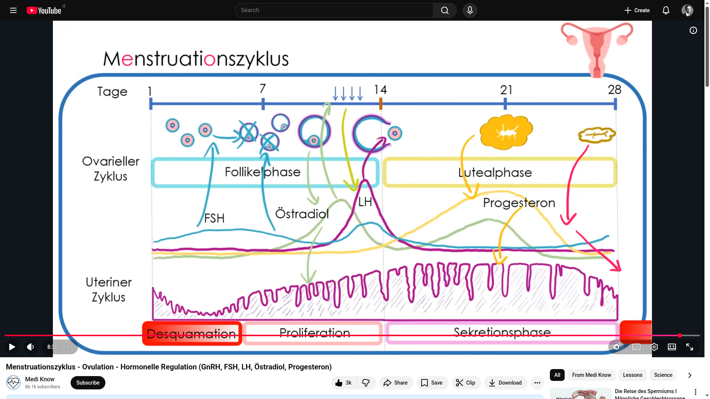

# Human female Biology

[Gonadotropins | Follicle Stimulating Hormone (FSH) and Luteinizing Hormone (LH) Dr Matt & Dr Mike](https://www.youtube.com/watch?v=YE-a7XiEYB4)  

[Hormones: Are Your Hormones Normal? What Do your Lab Numbers Mean? Natalie Crawford, MD](https://www.youtube.com/watch?v=uglyMKu3hOg&t=19s)  

---

# Weiblische Biologie und Physiologie

[Was passiert wirklich in deinem Körper? Der Menstruationszyklus erklärt | Dr. Claudia Bignion Dr. Claudia Bignion](https://www.youtube.com/watch?v=a7h1vbhAX6w)  

[Das Hormonsystem / endokrine System des Menschen (Animation) Thomas Schwenke](https://www.youtube.com/watch?v=VhWCF27xXRE)   

[Schwangerschaft - So entsteht ein kleines Wunder (Animation) Thomas Schwenke](https://www.youtube.com/watch?v=0CtIIt4_uy4)    

---

# [Der Menstruationszyklus - Ovulation - Hormonelle Regulation (GnRH, FSH, LH, Östradiol, Progesteron) Medi Know](https://www.youtube.com/watch?v=DOpoNkcrmfA)  




## Zusammenfassung des Menstruationszyklus: einer Überblick über alle Prozesse.

1. Es gibt einen 28-tägigen Menstruationszyklus, der in zwei Teile unterteilt werden kann.
2. Der erste Teil ist `ovarieller Zyklus` genannt.
3. Der tweite Teil ist `uteriner Zyklus` genannt.
4. Beide diese Teile haben zwei aufeinanderfolgende Phasen.
5. Der erste Phase des ovariellen Zyklus ist die Follikelphase. 
6. Während der Follikelphase wird eine Kohorte von Follikeln rekrutiert und unter dem Einfluss des FSH-Hormons, das in das Bild mit einer blauen Linie gezeichnet ist, heranreifen. 
7. Die Granulosazellen im Eierstock sind FSH-abhängig und bilden Aromatase-Östradiol (das Östradiol ist die grüne Linie im Bild) aus dem Androstendion, das meist aus der Nebennierenrinde und den Gonaden ausgeschüttet worden ist.
8. Das Östradiol-Hormon führt eine negative Rückkopplung auf das FSH-Hormon aus, deshalb wird man im Bild sehen, dass die grüne Linie des Östradiols steigt und gleichzeitig die blaue Linie des FSH-Hormons fällt. 
9. Wegen des Falls auf FSH-Hormon werden nur die Follikel der selektierten Kohorte, die die meisten Rezeptoren für FSH-Hormon besitzen, den Reifungsprozess vollenden. Schließlich wird nur ein dominanter Follikel überleben und komplette Reifung erhalten.
10. Der dominante Follikel bildet weiter Östradiol und der FSH-Hormon-Spiegel stürzt widerum weiter über die negative Rückkopplung auf FSH-Hormon.
11. Das Östradiol sorgt für die Proliferation, also das Wachstum des Endometriums, also des Uterus. 
12. Das Östradiol führt nicht nur eine negative Rückkopplung auf das FSH-Hormon aus, außerdem ist es auch auf das GnRH (Gonadropin) positiv rückgekoppelt. Da das GnRH das Vorstufenmaterial für die Synthese der Hormone FSH und LH ist, wird deren Produktion steigen. 
13. Eigentlich wird die positive Rückkopplung des Östradiols auf das Gonadotropin (GnRH) pulsativ sein. Da kann man in dieser Phase eine starke GnRH-Pulssequenz beobachten.

[sequentiell](https://www.collinsdictionary.com/dictionary/german-english/sequentiell) = sequenziel
[sequenziell](https://www.collinsdictionary.com/dictionary/german-english/sequenziell)  
> sequenziell generiert
die [Sequenz](https://www.collinsdictionary.com/dictionary/german-english/sequenz)  
> eine starke Pulssequenz
der [Pulsschlag](https://www.collinsdictionary.com/dictionary/german-english/pulsschlag)  
der [Puls](https://www.collinsdictionary.com/dictionary/german-english/puls)   
> pulsativ vorkommen / geschehen, eine starke Pulssequenz 
die [Synthese](https://www.collinsdictionary.com/dictionary/german-english/synthese)  
[rückkoppeln](https://www.collinsdictionary.com/dictionary/german-english/ruckkoppeln)  

--- 

Zusammenfassend:

Das Follikelepithel ist eine spezialisierte Schicht aus Epithelzellen, 
die ein bläschenartiges Gebilde (Follikel) auskleidet. Es kommt 
hauptsächlich in zwei Formen vor: 

1. Als Granulosazellen im Eierstock, die die Eizelle umgeben und ernähren
2. Als Thyreozyten in der Schilddrüse, die Hormone produzieren

Das GnRH (Gonadotropin) ist der Bauteil für die Hormone FSH und LH.

Das luteinisierende Hormon (LH) wirkt auf die TK-Zellen, weil die LH-Rezeptoren haben. 
Sie sind LH-abhängig, und konnten das Androstendion, ein männliches Sexualhormon, 
aus dem Cholesterin bilden. 

Die Granulosazellen, die nur in Weibe geben, sind FSH-abhängig und bilden Aromatase-Östradiol 
aus dem Androstendion. Das Aromatase-Östradiol ist sorgt für die Verflüssigung des Schleims 
im Gebärmuttershals um die Spermien leichter in die Uterushöhle einzudringen lassen. 
Außerdem wird das Aromatase-Östradiol auch verusachen, dass die Uterusschleimhaut nach 
der Menstruation wieder wächst. 

Das FSH-Hormon stimuliert die Follikelproduktion, aber durch **die negative Rückkopplung** 
des Östradiols über das GnRH-Hormon, fällt es zurück. Das verursacht nun, dass nur die 
Follikel, die am meisten FSH-Rezeptoren haben, überleben können. Die Überlebenden
Follikel werden dominante Follikel genannt und sie gehen weiter, um mehr Östradiol-Hormon
zu ausschütten.

Schließlich handelt es sich bei diesem letzten Mechanismus um **eine positive Rückkopplung**, 
die die zuvor dargestellte negative Rückkopplung **ausgleicht**. 
Der Konzentrationsanstieg an GnRH (Gonadotropin), den durch diese positive Rückkopplung
vorkommt, **löst den Eisprung aus**, der auch `Ovulation` genannt wird.


## Was ist die die symptothermale Methode?

Die symptothermale Methode (NFP) ist eine sehr sichere, natürliche und hormonfreie Methode 
zur Verhütung oder Kinderwunschplanung. Sie kombiniert die tägliche Messung der Basaltemperatur 
mit der Beobachtung des Zervixschleims, um fruchtbare von unfruchtbaren Tagen zu unterscheiden. 
Mit einem Pearl-Index von 0,4–1,8 ist sie bei korrekter Anwendung sehr zuverlässig.

### Grundlagen und Anwendung:

- Basaltemperatur: 
Messung der Temperatur direkt nach dem Aufwachen vor dem Aufstehen, am besten mit 
2-Nachkommastellen-Thermometer. Nach dem Eisprung steigt die Temperatur um mindestens 
\(0,2 \text{°C}\) an.

- Zervixschleim: 
Der Schleim am Muttermund verändert sich durch Hormone, wird vor dem Eisprung spinnbar/durchsichtig 
und danach fest/weniger.

- Auswertung: 
Die fruchtbaren Tage enden erst, wenn die Temperatur gestiegen ist und die Zervixschleimqualität 
wieder abgenommen hat (Doppelkontrolle).

- Anwendung: 
Geeignet für Frauen mit regelmäßigem Lebensstil, da Störfaktoren wie Alkohol, spätes Essen oder 
unruhiger Schlaf die Temperatur beeinflussen können.

### Vorteile und Herausforderungen:

- Vorteile: 
Keine Hormone, keine Nebenwirkungen, hohe Sicherheit, fördert das Körperbewusstsein.

- Herausforderungen: 
Erfordert Disziplin (tägliche Messung), Einarbeitungszeit (ca. 3 Zyklen empfohlen), Verzicht auf ungeschützten Verkehr an fruchtbaren Tagen.Die Methode, besonders in der Form von Sensiplan®, ist eine zuverlässige, evidenzbasierte Alternative zur Pille.

die [Einarbeitungszeit](https://www.collinsdictionary.com/dictionary/german-english/einarbeitungszeit)
die [EInarbeitung](https://www.collinsdictionary.com/dictionary/german-english/einarbeitung) = das Training, die Einfügung  
[einarbeiten](https://www.collinsdictionary.com/dictionary/german-english/einarbeiten)  
> sie muss sich in ihr neues Gebiet einarbeiten
[einfügen](https://www.collinsdictionary.com/dictionary/german-english/einfugen) (=sich anpassen) 
> sich an der neuen Methode anpassen / einfügen.
> [2]: die neue Maschine ia ihrem Platz einfügen

## Die erste Phase: die Follikelphase (Tag 1-14)

die [Übelkeit](https://www.collinsdictionary.com/dictionary/german-english/ubelkeit)  
Übelkeit [erregen](https://www.collinsdictionary.com/dictionary/german-english/erregen) = verursachen = erzeugen
> übelkeitserregend 
Ein übelkeitserregender Stoff.
[anstecken](https://www.collinsdictionary.com/dictionary/german-english/anstecken)
> sich anstecken: Ich habe mich mit Übelkeit am Bauch angesteckt.
> ich will dich nicht anstecken 
Eine infektiöse Krankheit übertragen
[infektiös](https://www.collinsdictionary.com/dictionary/german-english/infektios)     
der Infekt = der Infektion
der [Infekt](https://www.collinsdictionary.com/dictionary/german-english/infekt), die Infekte  

[enststehen](https://www.collinsdictionary.com/dictionary/german-english/entstehen)   
> enstehen = in  Dasein treten  

> (sich) aus den Restens von etwas enstehen

> Wichtig!

Die zweite Phase des Menstruationszyklus ist die Lutealphase.
Während die Follikelphase durch Infekte oder Stress variieren kann,
ist die Lutealphase relativ konstant 14 Tage lang. 

Das `Corpus luteum`, das auch „Gelbkörper“ genannt wird, entsteht 
aus den Restens des `Follikelepithel` in die Lutealphase.

[einlagern](https://www.collinsdictionary.com/dictionary/german-english/einlagern)  
das Fett, die Fette
TK-Zellen und Granulosazellen werden durch das LH-Hormon Fette einlagern.
die [Einlagerung](https://www.collinsdictionary.com/dictionary/german-english/einlagerung) 
Die Einlagerung von Fetten in Zellen oder von Mineralien in Gestein.
[weiterhin](https://www.collinsdictionary.com/dictionary/german-english/weiterhin) (=außerdem)

Das LH-Hormon stimuliert die Fetteinlagerung in die TK-Zellen und Granulosazellen.
Die TK-Luteinzellen bilden weiterhin Androstendion und die Granulosa-Luteinzellen
können daraus weiterhin Östradiol machen.

das [Enzxym](https://www.collinsdictionary.com/dictionary/german-english/enzym)  
die [Nbenenieren](https://www.collinsdictionary.com/dictionary/german-english/nebenniere) = suprarenal gland, adrenal body
die [Gonade](https://www.collinsdictionary.com/dictionary/german-english/gonade)  

[besonders](https://www.collinsdictionary.com/dictionary/german-english/besonders) 
> besonders: usdrücklich, vor allem / besonders gut oder hübsch aussehen
> besonders wenig Fehler / besonders weniger
> besonders:  (= speziell) 

> hochregulieren

[vermehren](https://www.collinsdictionary.com/dictionary/german-english/vermehren)  
> Die Bakterien verhmeren (=fortpflanzen) lassen.
> Die Produktion von Hormonen vermehren.

Das P450scc-Enzym wird in diese zweite Phase des Menstruationszyklus, die Lutealphase, 
hochreguliert, um die Produktion von Androstendion und auch anderen Steroidhormonen 
zu stimulieren, besonders wird viel mehr `Progesteron` von dem vermehrten `Androstendion` 
synthetisiert.

> das Schwangerschaftshormon = das Progesteron
> die Uterusschleimhaut 
> für etwas sorgen; es sorgt dafür, dass...

> die Lipiden, die Proteinen, das Glykogen
das [Protein](https://www.collinsdictionary.com/dictionary/german-english/protein) = das Eiweiß
das [Eiweiß](https://www.collinsdictionary.com/dictionary/german-english/eiweiss)  
der [Eiweißgehalt](https://www.collinsdictionary.com/dictionary/german-english/eiweissgehalt)  
[eiweißarm](https://www.collinsdictionary.com/dictionary/german-english/eiweissarm)  ein eiweißarmes Stoff
[eiweißreich](https://www.collinsdictionary.com/dictionary/german-english/eiweissreich)
[eiweißhaltig](https://www.collinsdictionary.com/dictionary/german-english/eiweisshaltig)  

Das `Progesteron` ist das Haupthormon dieser Phase. Es ist ein wichtiges Schwangerschaftshormon, weil
es dafür sorgt, dass die Uterusschleimhaut vorbereitet wird für die befruchtete Eizelle.
Das Endometrium, das auch die Gebärmutterschleimhaut genannt ist, wird mit Lipiden, Proteinen und Glykogen
eingebaut, damit die befruchtete Eizelle wohl fühlt.

[verdicken](https://www.collinsdictionary.com/dictionary/german-english/verdicken)  
die [Verdickung](https://www.collinsdictionary.com/dictionary/german-english/verdickung)   

[verdichten](https://www.collinsdictionary.com/dictionary/german-english/verdichten)  
die [Verdichtung](https://www.collinsdictionary.com/dictionary/german-english/verdichtung)

[zervikal](https://www.collinsdictionary.com/dictionary/german-english/zervikal)  
> der zervikale Schleim, der Zervikalschleim

Das Progesteron wird auch die Verdickung des Zervikalschleims verursachen, die wiederum 
neuen Spermen verhindern wird, die Uterus zu eindringen.

> die symptothermale Methode
Wichtig ist auch zu wissen, dass die Produktion des Progesterons auch einen Anstieg 
der Basaltemperatur von etwas zwischen einem Viertel und einem halben Grad verursachen wird.
Diese zwei Ereignisse werden im Rahmen der symptothermalen Methode verwendet.

die [Verhütung](https://www.collinsdictionary.com/dictionary/german-english/verhutung) = Empfängnisverhütung
das [Verhütungsmittel](https://www.collinsdictionary.com/dictionary/german-english/verhutungsmittel)  
> eine natürliche Verhütungsmethode
der [Spiegel](https://www.collinsdictionary.com/dictionary/german-english/spiegel) 
> der Konzentrationsspiegel

Schließlich wird das Progesteron auf einer negativen Rückkopplung auf dem GnRH-Hormon aktiv sein, 
die wiederum zu dem Abstieg der Konzentrationsspiegel des FSH-Hormons und des LH-Hormons führt.

###  Was ist die Basaltemperatur?

Die Basaltemperatur (Aufwachtemperatur) ist die niedrigste Körpertemperatur im Ruhezustand, 
die direkt nach dem Aufwachen und vor dem Aufstehen gemessen wird. Sie steigt nach dem 
Eisprung durch das Hormon Progesteron um ca. \(0,25–0,5\text{°C}\) an, was zur Bestimmung 
der fruchtbaren Tage (natürliche Familienplanung) oder zur Zyklusbeobachtung genutzt wird.

> Wichtige Fakten zur Basaltemperatur:

- Messzeitpunkt: 
Täglich morgens, unmittelbar nach dem Aufwachen, noch im Bett.

- Messort: 
Die Messung sollte immer an derselben Stelle (oral, vaginal oder rektal) mit einem digitalen 
2-Nachkommastellen-Thermometer erfolgen.

- Zyklusphasen: 
In der ersten Zyklushälfte (vor dem Eisprung) ist die Temperatur niedriger (Tieflage), 
nach dem Eisprung steigt sie an und bleibt bis zur nächsten Periode erhöht (Hochlage).

- Eisprung-Indikator: 
Ein Anstieg der Temperatur über mindestens drei aufeinanderfolgende Tage signalisiert, dass 
der Eisprung stattgefunden hat.

- Einflussfaktoren: 
Störfaktoren wie Alkohol, Schlafmangel, Stress oder Infekte können die Temperaturmessung verfälschen.

Die Aufzeichnung der Basaltemperatur ermöglicht es, die unfruchtbare Zeit nach dem Eisprung zu identifizieren, 
ist jedoch aufgrund der verzögerten Anzeige nicht zur präzisen Vorhersage des Eisprungs geeignet, da dieser 
meist kurz vor dem Anstieg liegt.

Die Messung der Basaltemperatur ermöglicht die Bestimmung der unfruchtbaren Phase nach dem Eisprung,
ist aber aufgrund der verzögerten Anzeige nicht geeignet, den Eisprung genau vorherzusagen, da diese
üblicherweise kurz vor dem Temperaturanstieg erfolgt.

### Was hat das P450scc-Enzym mit Androstendion zu tun?

Das P450scc-Enzym ist das initiierende Enzym in der gesamten Steroidhormonsynthese. 
Es stellt zwar keine direkte Verbindung zu Androstendion dar, ist aber der erste entscheidende Schritt, 
ohne den Androstendion nicht gebildet werden kann.

### Was ist das P450scc-Enzym?

P450scc (Cholesterin-Monooxygenase, CYP11A1 oder P450c11a1) ist ein lebensnotwendiges mitochondriales Enzym, 
das die Umwandlung von Cholesterin in Pregnenolon katalysiert. Es ist der erste und 
geschwindigkeitsbestimmende Schritt bei der Synthese aller **Steroidhormone (Cortisol, Aldosteron, Geschlechtshormone)** 
in **Nebennieren, Gonaden und Plazenta**.

### Was sind die Gonade?

Die Gonaden (Keimdrüsen) sind die paarig angelegten Fortpflanzungsorgane von Menschen und Tieren, 
die Keimzellen (Ei- oder Samenzellen) sowie Sexualhormone (Östrogen, Testosteron) produzieren. 
Sie zählen zu den primären Geschlechtsmerkmalen und entwickeln sich embryonal aus einer 
gemeinsamen Anlage zu Hoden (beim Mann) oder Eierstöcken (bei der Frau).

### Was ist das Follikelepithel?

Das Follikelepithel ist eine spezialisierte Schicht aus Epithelzellen, 
die ein bläschenartiges Gebilde (Follikel) auskleidet. Es kommt 
hauptsächlich in zwei Formen vor: 

1. Als Granulosazellen im Eierstock, die die Eizelle umgeben und ernähren
2. Als Thyreozyten in der Schilddrüse, die Hormone produzieren

### Was ist das Corpus luteum?

> die Eibläschen [egg follicle] = der Follikel
[zurückbilden](https://www.collinsdictionary.com/dictionary/german-english/zuruckbilden)  
> sich zurückbilden = abnehmen = abbauen =
[zurücknehmen](https://www.collinsdictionary.com/dictionary/german-english/zurucknehmen)  
[bestehen bleiben](https://www.collinsdictionary.com/dictionary/german-english/bestehen-bleiben)  
> bestehen bleiben: Hoffnung, Versprechen, Vereinbarungen

Das Corpus Luteum (Gelbkörper) ist eine temporäre, hormonproduzierende Drüse im Eierstock, 
die nach dem Eisprung (Ovulation) aus dem Eibläschen (Follikel) entsteht. Es produziert 
hauptsächlich Progesteron, das den Zyklus reguliert und eine Schwangerschaft durch den 
Aufbau der Gebärmutterschleimhaut vorbereitet. Ohne Befruchtung bildet es sich zurück, 
bei Schwangerschaft bleibt es bestehen.

Das Corpus `Granulosaluteinzellen` im `Gelbkörper` (`Corpus luteum`)


[im Endeffekt](https://www.collinsdictionary.com/dictionary/german-english/endeffekt)  
`das GnRH-Hormon` = `Gonadotropin releasing hormon GnRH`
die [Rückkoppelung](https://www.collinsdictionary.com/dictionary/german-english/ruckkoppelung) = die Rückkopplung.
> eine negative Rückkopplung auf etwas ausführen  
[ausführen](https://www.collinsdictionary.com/dictionary/german-english/ausfuhren)   
> Etwas über negative Rückkuplung hemmen
die [Vorstufe](https://www.collinsdictionary.com/dictionary/german-english/vorstufe)   
der [Bauteil](https://www.collinsdictionary.com/dictionary/german-english/bauteil)    

[1] der [Abfall](https://www.collinsdictionary.com/dictionary/german-english/abfall) = die Reduzierung
die [Reduzierung](https://www.collinsdictionary.com/dictionary/german-english/reduzierung)  
[reduzieren](https://www.collinsdictionary.com/dictionary/german-english/reduzieren) = zurückführen auf (+Ak.) [2] [Chem.]
[abfallen](https://www.collinsdictionary.com/dictionary/german-english/abfallen) = [1] herunterfallen; [2] sich senken; [3] schlechter verden

der [Anstieg](https://www.collinsdictionary.com/dictionary/german-english/anstieg) = der Aufstieg  
der [Aufstieg](https://www.collinsdictionary.com/dictionary/german-english/aufstieg)  
der Anstieg von Temperatur, Kosten, Preisen, Menge, Anteil auf etwas,..
[ansteigen](https://www.collinsdictionary.com/dictionary/german-english/ansteigen) = aufsteigen 
Die Temperatur steigt (=steigt an) (= höher wird)
Der Konzentrationsanstieg = Der höheren Konzentration an Hormonen

der [Mechanismus](https://www.collinsdictionary.com/dictionary/german-english/mechanismus)  
ausgleichen = abwägen = auszubalancieren [balancieren](https://www.collinsdictionary.com/dictionary/german-english/balancieren)  

[zuvor](https://www.collinsdictionary.com/dictionary/german-english/zuvor) = zuerst
> im Jahr zuvor, am Tage zuvor
[vorher](https://www.collinsdictionary.com/dictionary/german-english/vorher) = früher = zuvor
> am Tag(e) vorher 

[auslösen](https://www.collinsdictionary.com/dictionary/german-english/auslosen_2) = auswirken != auslosen
[auswirken](https://www.collinsdictionary.com/dictionary/german-english/auswirken)  
den Eisprung auslösen
der [Auslösung](https://www.collinsdictionary.com/dictionary/german-english/auslosung_2)  
Der Auslösung von Eizellen

Zusammenfassend:

Das GnRH (Gonadotropin) ist der Bauteil für die Hormone FSH und LH.

Das luteinisierende Hormon (LH) wirkt auf die TK-Zellen, weil die LH-Rezeptoren haben. 
Sie sind LH-abhängig, und konnten das Androstendion, ein männliches Sexualhormon, 
aus dem Cholesterin bilden. 

Die Granulosazellen, die nur in Weibe geben, sind FSH-abhängig und bilden Aromatase-Östradiol 
aus dem Androstendion. Das Aromatase-Östradiol ist sorgt für die Verflüssigung des Schleims 
im Gebärmuttershals um die Spermien leichter in die Uterushöhle einzudringen lassen. 
Außerdem wird das Aromatase-Östradiol auch verusachen, dass die Uterusschleimhaut nach 
der Menstruation wieder wächst. 

Das FSH-Hormon stimuliert die Follikelproduktion, aber durch **die negative Rückkopplung** 
des Östradiols über das GnRH-Hormon, fällt es zurück. Das verursacht nun, dass nur die 
Follikel, die am meisten FSH-Rezeptoren haben, überleben können. Die Überlebenden
Follikel werden dominante Follikel genannt und sie gehen weiter, um mehr Östradiol-Hormon
zu ausschütten.

Schließlich handelt es sich bei diesem letzten Mechanismus um **eine positive Rückkopplung**, 
die die zuvor dargestellte negative Rückkopplung **ausgleicht**. 
Der Konzentrationsanstieg an GnRH (Gonadotropin), den durch diese positive Rückkopplung
vorkommt, **löst den Eisprung aus**, der auch `Ovulation` genannt wird.

Wenn **alles**, was hier oben beschrieben ist, **vervollständigt ist**, endet die Follikelphase.
Das wird **ungefähr um** den 14. Tag des Menstruationszyklus.

[selektieren](https://www.collinsdictionary.com/dictionary/german-english/selektieren)  
die [Selektion](https://www.collinsdictionary.com/dictionary/german-english/selektion)  
> sich an etwas (+gen.) beteiligt sein / werden; jdn an etwas beteiligen

Außerdem ist das **Aromatase Östradiol**, das von den Granulosazellen ausgeschüttet wird, 
beteiligt an der Selektion der Follikel. Das Östradiol wird das Gonadotropin 
über eine negative Rückkupplung (GnRH) hemmen und auch das LH-Hormon und das FSH-Hormon
werden reduziert ausgeschüttet.


> sodass: [so that] 
> somit: [thus, therefore, consequently] 

das [Sperma](https://www.collinsdictionary.com/dictionary/german-english/sperma)  
die Spermien
die [Höhle](https://www.collinsdictionary.com/dictionary/german-english/hohle)  
die Uterushöhle
[verflüssigen](https://www.collinsdictionary.com/dictionary/german-english/verflussigen)  
die [Verflüssigung](https://www.collinsdictionary.com/dictionary/german-english/verflussigung)  
Die Verflüssigung des Schleimes in das Gebärmuttershals
`das Aromataseöstradiol` = das Aromatase-Östradiol
`die Uterusschleimhaut`

Die Granulosazellen sind FSH-abhängig und bilden Aromataseöstradiol aus dem Androstendion.
Das Aromatase-Östradiol ist ein wichtiges Hormon, das dafür sorgt, dass die Uterusschleimhaut
nach der Menstruation wieder wächst. Außerdem wird das Aromatase-Östradiol zur Verflüssigung
des Schleims im Gebärmuttershals führen, **sodass** die Spermien leichter in die Uterushöhle 
eindringen können.

> im Verlauf des.. > im Verlauf + gen.
die [Schwangerschaft](https://www.collinsdictionary.com/dictionary/german-english/schwangerschaft)
bei ausbleibender Schwangerschaft
[auskleiden](https://www.collinsdictionary.com/dictionary/german-english/auskleiden) = entkleiden 
[entkleiden](https://www.collinsdictionary.com/dictionary/german-english/entkleiden)  
die Auskleidung > eine Auskleidung der Gebärmutter

> Was ist die die Uterusschleimhaut?

`Die Uterusschleimhaut (Endometrium)` ist die innere **Auskleidung der Gebärmutter**, 
die sich `im Verlauf des` weiblichen Zyklus unter Hormoneinfluss aufbaut, um eine 
befruchtete Eizelle aufzunehmen. Sie dient der `Einnistung` des `Embryos` und wird 
**bei ausbleibender Schwangerschaft** während der Menstruation abgebaut.  +3

`das Androstendion`
`Das Cholesterin, auch Cholesterol` : ein fettiger Naturstoff

Die TK-Zellen haben LH-Rezeptoren, d.h., sie sind LH-abhängig, und konnten das Androstendion
aus dem Cholesterin bilden.  

die [Vorstufe](https://www.collinsdictionary.com/dictionary/german-english/vorstufe)  
Die Vorstufe von eine Entwicklung oder eine Phase

> Was ist das Androstendion?

Das Androstendion ist ein schwach wirkendes `Steroidhormon` aus der Gruppe der Androgene 
(`männliche Sexualhormone`), das als zentrale **Vorstufe** bei der Bildung von `Testosteron`
und `Östrogen` dient. Es wird in der `Nebennierenrinde` und den `Keimdrüsen` (`Gonaden`) 
produziert und `spielt eine Schlüsselrolle` im `Hormonstoffwechsel` beider Geschlechter. 

> Wo kommt das Androstendion her?

Androstendion ist ein wichtiges Zwischenprodukt bei der Bildung von Sexualhormonen, 
das zu etwa gleichen Teilen in der Nebennierenrinde und den Gonaden (Keimdrüsen) 
– also Hoden beim Mann und Eierstöcken (Ovarien) bei der Frau – produziert wird. 
Es entsteht aus Dehydroepiandrosteron (DHEA) und ist eine gemeinsame Vorstufe 
für Testosteron, Estron und Estradiol.

Hier sind die Details zur Herkunft:

- Frauen: 
Das Androstendion stammt zu ca. 50 % aus der Nebennierenrinde und zu ca. 50 % aus der Thekazellschicht der Ovarien.

- Männer: 
Die Bildung erfolgt in der Nebennierenrinde und den Leydig-Zellen des Hodens.

- Wirkung & Rhythmus: 
Es hat eine mäßig ausgeprägte Tagesrhythmik mit den höchsten Werten in den frühen Morgenstunden.

- Klinische Bedeutung: 
Der Spiegel ist oft erhöht bei Polyzystischem Ovarialsyndrom (PCOS) oder Nebennierenrinden-Störungen.

> Was ist das Cholesterin?

Das Cholesterin, auch Cholesterol, ist ein in allen eukaryotischen Zellen vorkommender fettartiger 
Naturstoff. Alle Tiere und Menschen können Cholesterin selbst herstellen, mit Ausnahme mancher 
Nematoden und Arthropoden, die es aus der Nahrung aufnehmen müssen (Cholesterin-Auxotrophie).
Cholesterin ist ein essentieller Bestandteil aller tierischen Zellmembranen.

das `Ovar` = der Eierstock
der [Follikelsprung] = [Ovulation]
der [Follikel](https://www.collinsdictionary.com/dictionary/german-english/follikel), die Follikel  
`Granulosazellen und Thekazellen (TK-Zellen)`  
das [Östrogen](https://www.collinsdictionary.com/dictionary/german-english/ostrogen), die Östrogene  

Ein Follikel **besteht aus** einer Eizelle, die umgeben ist von `Granulosazellen` und `TK-Zellen`

`Granulosazellen und Thekazellen (TK-Zellen)` sind zwei essenzielle, funktionell unterschiedliche Zelltypen 
im Eierstock (das Ovar) von Säugetieren, die eng zusammenarbeiten, um `Follikelreifung`, `Eizellentwicklung` 
und `Steroidhormonproduktion` (insbesondere `Östrogene`) zu steuern. 

[umschließen](https://www.collinsdictionary.com/dictionary/german-english/umschliessen) = umgeben
[umgeben](https://www.collinsdictionary.com/dictionary/german-english/umgeben) 
[stimulieren](https://www.collinsdictionary.com/dictionary/german-english/stimulieren)   
die [Stimulierung](https://www.collinsdictionary.com/dictionary/german-english/stimulierung) = die Stimulation 
die [Stimulation](https://www.collinsdictionary.com/dictionary/german-english/stimulation)  
das [Enzym](https://www.collinsdictionary.com/dictionary/german-english/enzym), die Enzyme, Enzyme **produzieren**.
[umwandeln](https://www.collinsdictionary.com/dictionary/german-english/umwandeln)  > in (+ak.) etwas umwandeln
die [Umwandlung](https://www.collinsdictionary.com/dictionary/german-english/umwandlung)  von Strafe
> die Umwandlung des Androgenes in Östrogene 

---

### Granulosazellen (Follikelzellen)

> etwas durch etwas stützen
Die `Granulosazellen` (`Follikelzellen`) **umschließen direkt** die Eizelle (`Oozyte`) im Follikeln.
Sie stützen die `Eizellreifung` durch `parakrine Kommunikation`.
Nach **Stimulation** durch FSH (Follikelstimulierendes Hormon), produzieren sie `Enzyme`, 
insbesondere `Aromatase`, welche die von den `Thekazellen` produzierten Androgene in Östrogene 
(Estradiol) umwandeln.

```
Zusammenfassend:
Die Thekazellen produzieren Androgene und das Aromatase-Enzym verursacht die Umwandlung des Androgenes in Östrogene. 
```

> unter jds / etwas Einfluss sein / ewas tun
das Progesteron

Nach dem Eisprung wandeln die Granulosazellen sich **unter LH-Einfluss** (`Luteinisierendes Hormon`) 
zu `Granulosaluteinzellen` im `Gelbkörper` (`Corpus luteum`) um und produzieren `Progesteron`. 

---

### Thekazellen (TK-Zellen)

> vor allem, abgekürzt: v. a
der [Rezeptor](https://www.collinsdictionary.com/dictionary/german-english/rezeptor)    
[synthetizieren](https://www.collinsdictionary.com/dictionary/german-english/synthetisieren)  
die [Synthese](https://www.collinsdictionary.com/dictionary/german-english/synthese)  
die Östrogensynthese
Das Ausgangsmaterial für die Synthese von Östrogene wird von die TK-Zellen produziert.
> produzieren = etwas zu Verfügung stellen

Die TK-Zellen bilden die Hülle (`Theca folliculi`) um die `Granulosazellschicht` und 
unterteilen isch in: 

- Theca interna (drüsig, gefäßreich) 
- Theca externa (bindegewebig) 


Sie besitzen `LH-Rezeptoren` und produzieren **unter LH-Einfluss** Androgene (v.a. Androstendion) aus Cholesterin.
Sie stellen das Ausgangsmaterial (Androgene) für die Östrogensynthese der Granulosazellen zur Verfügung.

[entarten](https://www.collinsdictionary.com/dictionary/german-english/entarten) > die Entartung != degenerieren
[degenerieren](https://www.collinsdictionary.com/dictionary/german-english/degenerieren) > die Degeneration 
Entartungserscheinung

Es ist auch wichtig zu wissen, dass TK-Zellen können zu `Thekome` (seltene Tumoren) entarten.

---

die [Rekrutierung](https://www.collinsdictionary.com/dictionary/german-english/rekrutierung)  
[rekrutieren](https://www.collinsdictionary.com/dictionary/german-english/rekrutieren)  
> (sich) aus etwas rekrutiert

die [Kohorte](https://www.collinsdictionary.com/dictionary/german-english/kohorte)  
> eine Kohorte an Follikeln

`die Ovarien`

FSH und LH wirken dann auf die Ovarien, und zwar sorgen sie für 
die Rekrutierung einer Kohorte an Follikeln, die dann heranreifen.

[ausschutten](https://www.collinsdictionary.com/dictionary/german-english/ausschutten)  
die [Ausschüttung](https://www.collinsdictionary.com/dictionary/german-english/ausschuttung)  
[pulsieren](https://www.collinsdictionary.com/dictionary/german-english/pulsieren) > pulsierend Adj > [pulsatil] Adv
> pulsierender Gleichstrom
> puslatil auschüttten 

`Godnadotropin` das `FSH` (das Follikeln stimulierendes Hormon) > das Godnadotropinhormon
`das Gonadotropin` > `die Gonadotropine`
**die** `Adenohypophyse`
`das luteinisierende Hormon`
`das GnRH-Hormon` = `Gonadotropin releasing hormon GnRH`

> auf etwas wirken
> von ihrer Seite = [ihererseits](https://www.collinsdictionary.com/dictionary/german-english/ihrerseits)

**Der Hypothalamus** wird **ab** der Pubertät das `GnRH-Hormon` **pulsatil** ausschütten.
Dieses dann wirkt auf `Adenohypophyse`, die dann **wiederum** **ihrerseits** 
das `Gonadotropin` und das `luteinisierende Hormon`, die bzw. auch `FSH` und `LH` genannt sind, 
ausschütten.

Der Hypothalamus wird ab der Pubertät das GnRH-Hormon pulsatil ausschütten. 
Dieses dann wirkt auf der Adenohypophyse, die dann wiederum ihrerseits 
das Gonadotropin und das luteinisierende Hormon, 
die bzw. auch FSH und LH genannt sind, ausschütten.


[beteiligen](https://www.collinsdictionary.com/dictionary/german-english/beteiligen)  
> sich an etwas beteiligen: sich an den Unkosten beteiligen
die Beteiligung an .. = die Teilnahme an ... 
Der Hypothalamus ist **daran beteiligt**, die Geschlechtshormone zu steuern.

der Hypothalamus, die Drüse
das Hormon, die Hormone > die Geschlechtshormone
die [Pubertät](https://www.collinsdictionary.com/dictionary/german-english/pubertat)  
das [Pubertätsalter](https://www.collinsdictionary.com/dictionary/german-english/pubertatsalter) = die Pubertätszeit

[pubertär](https://www.collinsdictionary.com/dictionary/german-english/pubertar)   
das [Junge](https://www.collinsdictionary.com/dictionary/german-english/junge), die Jungen
das [Mädchen], die Mädchen

Die pubertären Veränderungen des Körpers **bei** **Mädchen und Jungen**.

`Der Hypothalamus` ist eine wichtige Drüse im Gehirn, die **ab** der Pubertät
**verantwortlich ist für** die Steuerung der Geschlechtshormone **im Körper**.

---

die [Koordination](https://www.collinsdictionary.com/dictionary/german-english/koordination) = die Steuerung 
[koordinieren](https://www.collinsdictionary.com/dictionary/german-english/koordinieren)
das Gehirn
das Zentrum [für..]
[regulieren](https://www.collinsdictionary.com/dictionary/german-english/regulieren) = einstellen
die Regulation
der `Hypothalamus` ist das übergeordnetes **Regulationszentrum** für verschiedenen Hormone.
das [Hormon](https://www.collinsdictionary.com/dictionary/german-english/hormon), die Hormone 

Der Menstruationszyklus wird vom Gehirn koordiniert durch Hormone, die vom Hypothalamus reguliert werden.

> sofern = wenn = im Fall
> von vorne beginnen
Sofern gibt es keine Einnistung, wird die Schleimhaut erneut abgestoßen und ein neues Menstrutionszyklus **beginnt von vorne**. 

> hierbei = währenddessen = bei dieser Gelegenheit = in diesem Zusammenhang
> in der zweite Hälfte des Menstruationzyklus = die zweite Zyklushälte
[umbauen](https://www.collinsdictionary.com/dictionary/german-english/umbauen)  
die Lutealphase 
die Sekretionphase
[einnisten](https://www.collinsdictionary.com/dictionary/german-english/einnisten)
die Eizelle : das Ei > GEN: Eis 
Die **Einnistung** eines **befruchteten** Eis in der Gebärmutter.

In der zweite Zyklushälte kommen parallel die `Lutealphase` und die `Sekretionphase`.
**Hierbei** baut sich die Gebärmutterschleim um, um sich vorzubereiten auf die mögliche
**Einnistung** eines befruchteten Eis. 

> als Antwort auf .. [+ Nominativ]
der Eierstock, die Eierstöcken

Als Antwort auf **die** Veränderung in den Ovarien, d.h. **die Eierstöcken**, 
verändert sich auch das Endometrium.

die [Schicht](https://www.collinsdictionary.com/dictionary/german-english/schicht), die Schichte  
[1] eine dünnne Schicht Öls schwebt auf Wasser. = eine dünne **Lage**  Öls schwebt auf Wasser.

> einmal .. und ..
das Endometrium 
die Basalis = die Regenerationschicht
die Funktionalis
**hormonabhängig** sein/werden
[abstoßen](https://www.collinsdictionary.com/dictionary/german-english/abstossen) = [wegstoßen] > [abschaffen][2]
[abschielfern](https://www.collinsdictionary.com/dictionary/german-english/abschilfern) > die Abschielferung
die **Proliferationsphase**

**Die Abschielferung** des Endometriums, wird **Desqumation** oder Menstruation gennant 
und sie geschiet **definitiongemäß** am ersten Tag des Mentruationszyklus.
Danach folgt das erneute Wachstum der Gebärmutterschleimhaut, sie wird auch **Proliferationsphase** genannt.

Man kann das Endometrium in **zwei Schichte** **unterteilen**.
**Einmal** **die Basalis, d.h. die Regenerationschicht**, und die **die Funktionalis**.
Diese ist **hormonabhängig** und wird **im Rahmen der Menstruation** **abgestoßen**. 

[degenerieren](https://www.collinsdictionary.com/dictionary/german-english/degenerieren)
die [Degeneration](https://www.collinsdictionary.com/dictionary/german-english/degeneration)  
> von vorne beginnen

das Corpusluteum
das Corpusalvikans

**Bei der Degeneration** des Corpusluteum entsteht das [Corpusalvikans] und 
die **ovariellen Zyklus** can von vorne beginnen.

[anschließen](https://www.collinsdictionary.com/dictionary/german-english/anschliessen) 
Die [Lutealphase]
das [Corpusluteum]

Dach shließt, ab dem 15. Tag, die sogennante Lutealphase an, die durch das sogenannten Corpusluteum geprägt ist.

[heranreifen](https://www.collinsdictionary.com/dictionary/german-english/heranreifen)  
der [Eisprung](https://www.collinsdictionary.com/dictionary/german-english/eisprung)
die [Ovulation] = der Eisprung

Durch die erste Phase des Zyklus, die man Follikelphase nennt, reifen die Follikeln heran,
bis es am 14. zum Eisprung, der auch Ovulation gennant wird, kommt.

die durchschnittliche [Dauer](https://www.collinsdictionary.com/dictionary/german-english/dauer) eines Zyklus ist 28 Tage.
Ein **durchschnittlicher** Menstruationszyklus **dauert** 28 Tage.

der [Follikel](https://www.collinsdictionary.com/dictionary/german-english/follikel)

die [Phase](https://www.collinsdictionary.com/dictionary/german-english/phase)  
die [Hälfte](https://www.collinsdictionary.com/dictionary/german-english/halfte)  
die este Phase des Zyklus = die erste Zyklushälfte

Die [Follikelphase] ist die erste Zyklushälfte.
Die erste Zyklushälfte **in den Ovarien** wird Follikelpahse genannt.

[ablaufen](https://www.collinsdictionary.com/dictionary/german-english/ablaufen)  

Der Mestruationszyklus umfasst zwei **parallel ablaufenden** Zyklen.
> zum einen und zum zweiten...
> eine zyklische Veränderung
Zum einen der ovariellen Zyklus, der in den Ovarien bzw. in der Eistöcken stattfindet,
und zum zweite, die zyklische Veränderung der Gebärmutterschleimhaut.

die [Gebärmutter](https://www.collinsdictionary.com/dictionary/german-english/gebarmutter)  
das [Uterus] = die Gebärmutter  

die [Schleimhaut](https://www.collinsdictionary.com/dictionary/german-english/schleimhaut)  
die Gebärmutterschleimhaut = das [Endometrium]  

[menstruieren](https://www.collinsdictionary.com/dictionary/german-english/menstruieren)  
der Menstruationszyklus
die [Menstruation](https://www.collinsdictionary.com/dictionary/german-english/menstruation)   
die Menstruation wird auch **Desquamation** genannt und stellt **definitiongemäß** 
den ersten Tag des **Mensatruationszyklus** dar.

der [Zyklus](https://www.collinsdictionary.com/dictionary/german-english/zyklus)  > di Zyklen
der ovarieller Zyklus

der [Eierstock](https://www.collinsdictionary.com/dictionary/german-english/eierstock), die Eierstöcken 
die [Ovarie](Tech.) für der EIerstock

---